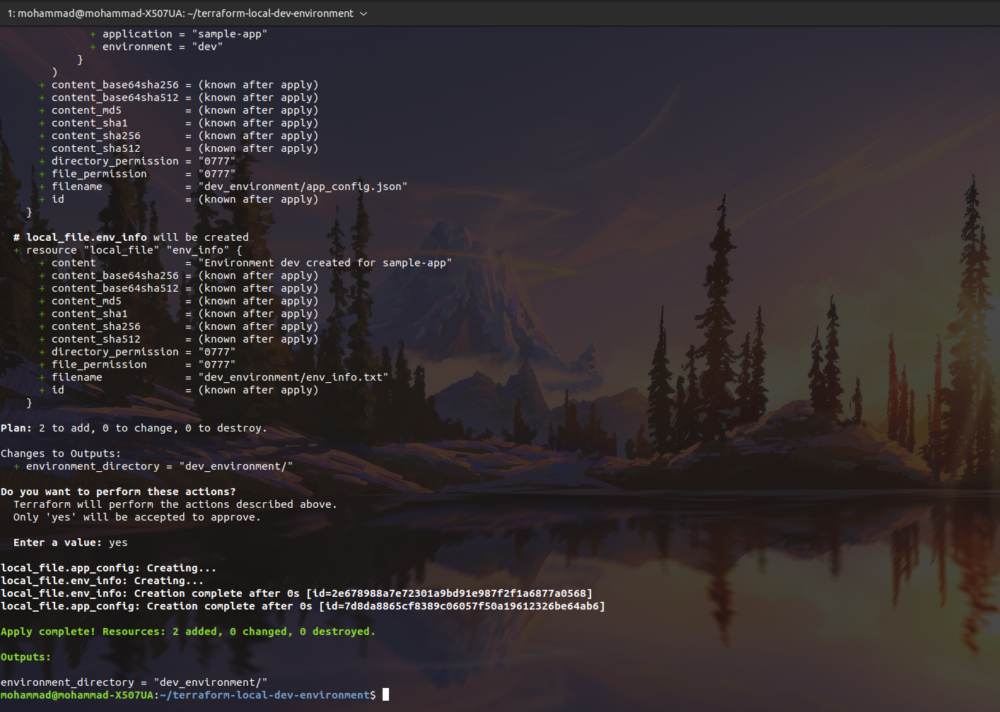

# Terraform Local Development Environment Automation

This project uses Terraform to automate the creation of local development
environments in a consistent and repeatable way.

## Features
- Environment-specific configuration (dev/test)
- Automated generation of configuration files
- Variable-driven infrastructure setup
- Declarative Infrastructure as Code using Terraform

## Use Case
Designed to standardize local development environments before extending
to containerized or cloud-based deployments.

## Tech Stack
- Terraform
- Infrastructure as Code (IaC)

## Previews

